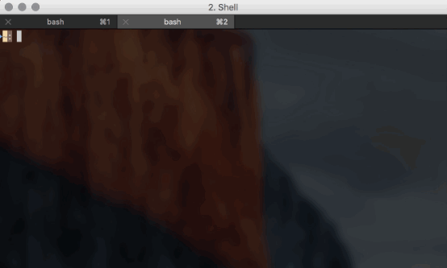

# GraphQL + Express + MongoDB

> A small project to illustrate using GraphQL with MongoDB in Express as simply as possible

#### Project Goals:
* Create a GraphQL + MongoDB + Express project that is as __simple as possible__
* __GraphiQL Integration__ to send Queries / Mutations
* Ability to use __Postman or other REST Client__ to POST GraphQL Queries / Mutations
* Use of __ES6__ (but minimally)
* Full Create, Update and Query from GraphQL to MongoDB

## Installation

#### ES6 / Node V4+
This project makes use of ES6 which requires a 4+ version of Node https://nodejs.org/en/download/

#### MongoDB
In order to run this project you need to install MongoDB and ensure an instance is running.
https://www.npmjs.com/package/mongodb

```js
npm install mongodb --save
mongod
```

To see the data you are saving you can use a MongoDB Manager App such as https://robomongo.org/

#### NPM Modules
The following NPM modules are required in package.json:

* express
* express-graphql
* graphql
* mongoose
* babel-cli
* babel-preset-es2015
* nodemon

Install with:

```js
npm install
```

#### Run the project

##### Running in Development
npm dev is configured with nodmon so that the server automatically restarts when code files are changes
```js
npm run dev
```

##### Running in Production
```js
npm start
```
npm prestart will run first, transpile the ES6 code and save to _dist_ folder. npm start will then run the code directly from the _dist_ folder



## Running GraphQL Mutations & Queries
You can run these queries / mutations within GraphiQL, alternatively you can run them within a tool such as Postman. To do so ensure you POST the query / mutation in the body and set the content-type to GraphQL.

#### Create a user
```js
mutation {
  addUser( name:"Jeff Beck", email:"jeff@beck.net", tel:"0800") {
    id,
    name,
    email,
    tel
  }
}
```

#### Find a user
Find the first user in the MongoDB, requesting just the name and email address
```js
query {
  userId(id:"56e0582a07be7df61583d9a4") {
    name,
    email
  }
}
```
#### Show all users
```js
query {
  users {
    id,
    name,
    email
  }
}
```

#### Update a user
```js
mutation {
  updateUser(id:"56e0919c2c4670ed23fe4a28", name:"Jeff The Beck", email:"jeff@beck.net", tel:"0800 234 231") {
    id
  }
}
```

## GraphQL Resolvers
GraphQL doesn't care where your data is stored, in this case it's in a MongoDB.

[userSchema.js](src/models/user/userSchema.js) uses a Mongoose Schemea and configures a number of exported functions for our GraphQL Resolvers to work with in order to load a user / list of users or create and update a user.

## GraphQL Schema
[userType.js](src/models/user/userType.js) creates a GraphQLObjectType describing the structure of our data model.

[userMutations.js](src/models/user/userMutations.js) and [userQueries.js](src/models/user/userQueries.js) specify the operations available from GraphQL and link to our resolvers, in this case Mongoose operations that return a promise.
